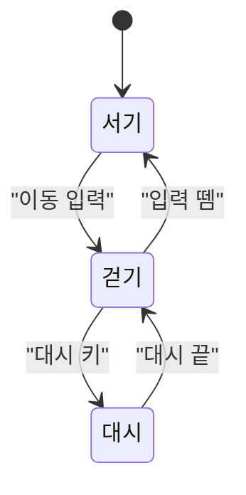

# 그림 그리기 규칙

> **AI 가 읽는 문서다.** 설계·기획 그림을 그릴 때 이 규칙을 따른다.
> 여기 없는 그림은 그리지 않는다. 왜 그런지는 `Docs/Design/2026-08-20-설명용그림툴설계.md` 6장·7장에 있다.

## 1. 그림 종류별로 무엇을 쓰나

| 그리려는 것 | 쓸 것 |
| --- | --- |
| 레벨 도면 · 방 · 퍼즐 판 · 적 배치 | **타일맵** (`Guide/타일기호.md`) |
| 상태 전이 · 흐름 · 관계 | **Mermaid** (아래 2장) |
| 공격 프레임 · 페이싱 · 분포 | **표.** 막대는 도구가 만든다 |
| 이동 성능 · 히트박스 · 밸런스 수치 | **표만 쓴다.** 그리지 않는다 |

## 2. Mermaid

### 무엇에 쓰나

| 그림 | 종류 |
| --- | --- |
| 플레이어 이동 상태도 | `stateDiagram-v2` |
| 적 AI 행동 패턴 | `stateDiagram-v2` |
| 보스 페이즈 전환 | `stateDiagram-v2` |
| 카드 한 턴 흐름 · 우선권 | `stateDiagram-v2` |
| 코어 루프 | `flowchart` (닫힌 순환) |
| 스테이지 흐름 / 잠금-열쇠 | `flowchart` |
| 화면 흐름 | `flowchart` |
| 층 구조도 / 런 구조 | `flowchart` |
| 퍼즐 기믹 의존 (자물쇠-열쇠) | `flowchart` |
| 생산 사슬 · 테크 트리 | `flowchart` (엔진 C 가 표에서 만들어 준다) |
| 아키타입 하나 (셋업 → 페이오프) | `flowchart` |
| 클래스 관계 | `classDiagram` |

**상태 전이도 하나로 세 가지를 덮는다** (플레이어 이동 / 적 AI / 보스 페이즈).
**애니메이션 상태 기계는 따로 그리지 말고 이동 상태도에 합친다.**

### 지킬 것

1. **`-beta` 붙은 종류를 쓰지 않는다.** GitHub 의 Mermaid 버전이 뒤처져 안 그려질 수 있다.
2. **노드가 25개를 넘으면 쪼갠다.** 실제로 걸리는 자리가 둘이다.
   - **층 구조도** — 층 하나를 노드 하나로 줄이거나 막(act)별로 쪼갠다
   - **시너지 지도** — 전체 지도는 Mermaid 로 그리지 않는다. 진짜 자료는 `카드 × 아키타입` **행렬 표**다
3. **라벨은 항상 큰따옴표로 감싼다.** 괄호나 따옴표가 들어가면 파서가 깨진다.
4. **한국어 라벨을 쓴다.** 도구가 폭을 계산하므로 안 깨진다.

### 본보기

### 확인 방법

**Claude Code 터미널에서는 안 보인다.** GitHub 웹이나 VS Code 미리보기로 확인한다.

## 3. 그리지 않는 것

| 안 그림 | 대신 |
| --- | --- |
| 난이도 곡선 그래프 | **표.** 실무에도 전용 도구가 없다 |
| 점프 아크 곡선 | 파라미터 3개 (`h` · `x_h` · `v_x`) |
| 정밀 히트박스 도형 | 숫자 표. 모양은 게임을 켜서 본다 |
| 콤보 트리 | 기술 5개 이하면 표로 충분 |
| 아스키 박스 그림 | **LLM 이 못 그린다.** 타일맵만 예외 |
| 시스템 아키텍처도 | 코드를 본다. 문서로 두면 금방 거짓말이 된다 |
