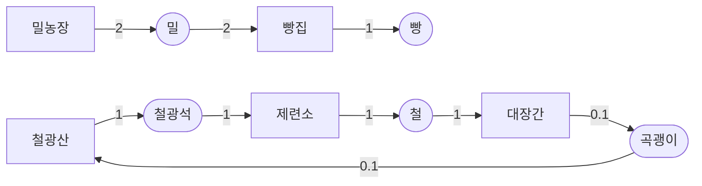
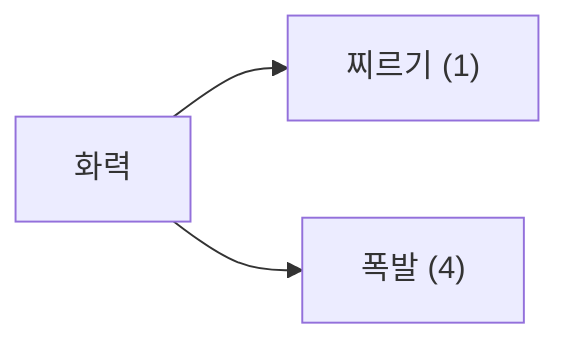
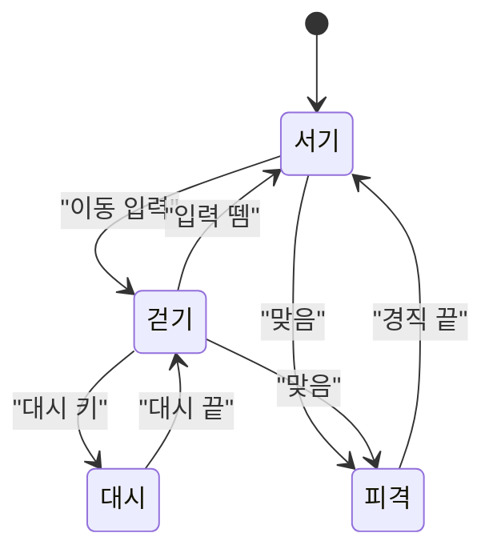

# 견본 — Mermaid 가 제대로 그려지나

**이 파일은 눈으로 보는 용도다.** 마크다운 미리보기(또는 GitHub 웹)로 열어서 네 개가 다 그려지면 통과다.
규칙은 `DiagramTool/Docs/Guide` 의 `그림그리기.md`.

---

## 1. 생산 사슬 — `lint.js` 가 표에서 뽑은 것

`node DiagramTool/src/lint.js DiagramTool/Test/견본-사슬.md --mermaid` 의 출력을 그대로 붙였다.
네모가 건물, 둥근 것이 자원이다. **곡괭이가 한 바퀴 도는 것이 보이면 맞다** — 일부러 넣은 순환이다.

## 2. 아키타입 하나 — 카드 표에서 뽑은 것

**카드 전체 시너지 지도는 Mermaid 로 그리지 않는다.** 아키타입 하나짜리만 그린다.

## 3. 이동 상태도 — 손으로 쓰는 것

`stateDiagram-v2` 하나로 플레이어 이동 · 적 AI · 보스 페이즈 셋을 덮는다.

## 4. 잠금-열쇠 흐름 — `견본.md` 의 던전 구간

타일맵으로 그린 구간을 흐름으로 다시 본 것이다. **격자는 배치를, 이 그림은 순서를 보여준다.**

---

## 확인표

| 보이는가 | 뜻 |
| --- | --- |
| 1번이 그려진다 | `lint.js` 의 `flowchart` 출력이 문법에 맞다 |
| 1번에 곡괭이 순환이 보인다 | 표 → 그림 변환이 관계를 안 잃었다 |
| 3번이 그려진다 | `stateDiagram-v2` 와 따옴표 라벨 규칙이 맞다 |
| 한글 라벨이 안 깨진다 | 규칙 4번(한국어 라벨)이 맞다 |
